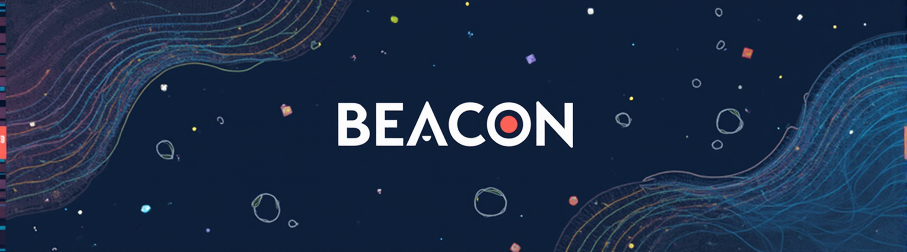
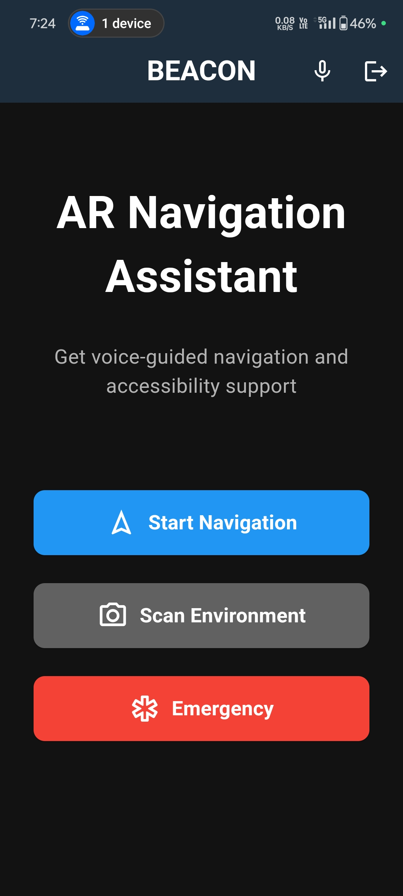
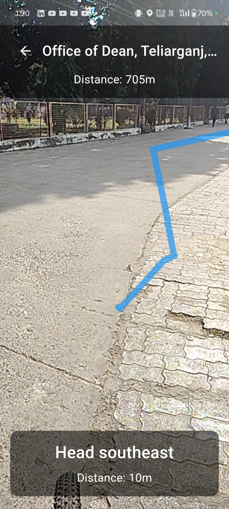
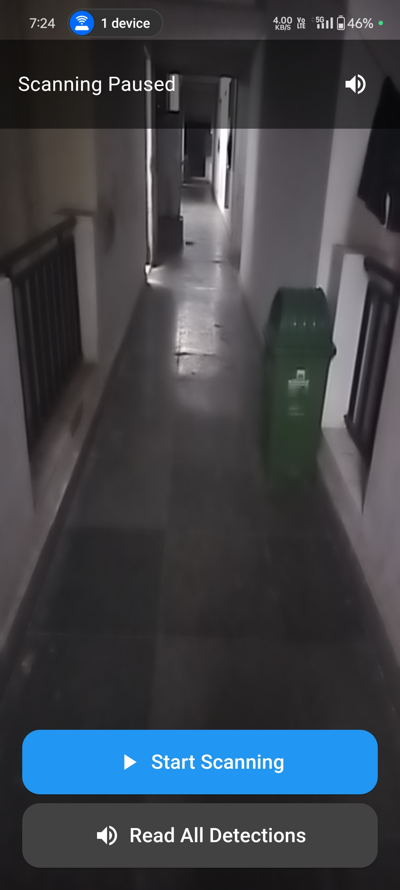
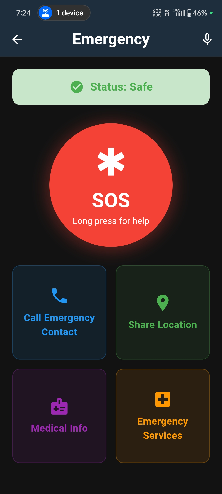

<h1 align="center" style="border-bottom: none">
    <b>
     An AR-powered app for visually impaired navigation with object detection, voice guidance, and community support.      </b>
 
</h1>

## Features
- 🗺️ **Real-time navigation** using OpenStreetMap and OpenRouteService
- 🎙️ **Voice command functionality** powered by Flutter TTS and Speech-to-Text
- 🚨 **Emergency page** to send current location via SMS or make calls to hospitals, police, or emergency contacts

# App Screenshots

Here are some screenshots of our app to showcase its features and interface.

| Home Screen | Navigation Screen | Scan Screen | Emergency Screen |
|-------------|-------------|----------------|-----------------|
|  |  |  |  |

## Contributing

Pull requests are welcome. For major changes, please open an issue first
to discuss what you would like to change.

Please make sure to update tests as appropriate.

## License

 
<a property="dct:title" rel="cc:attributionURL" href="https://github.com/Shanu-Kumawat/Beacon">Beacon</a> by <a rel="cc:attributionURL dct:creator" property="cc:attributionName" href="https://github.com/Shanu-Kumawat">Team Phoenix </a> is licensed under <a href="https://creativecommons.org/licenses/by-nc-nd/4.0/?ref=chooser-v1" target="_blank" rel="license noopener noreferrer" style="display:inline-block;">CC BY-NC-ND 4.0</a>
 
